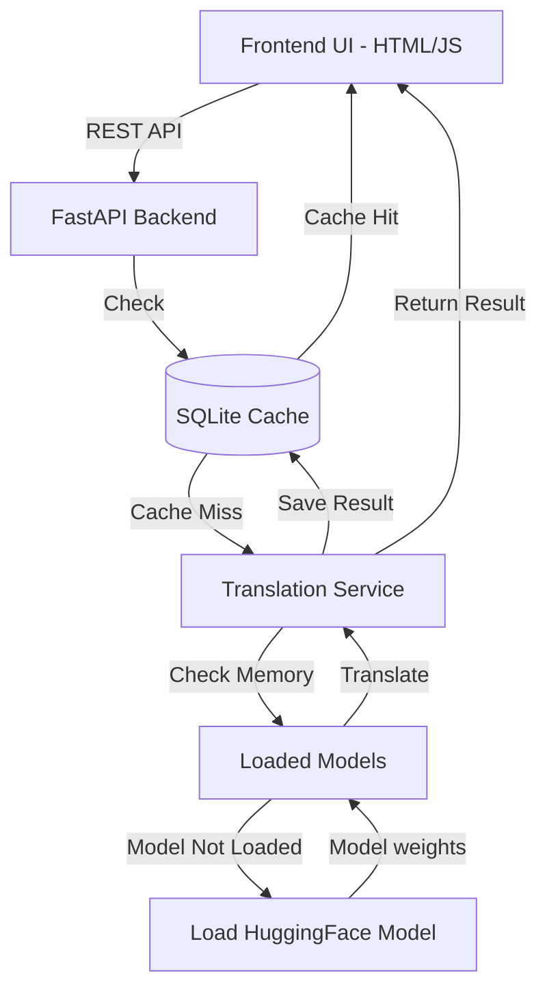

# Translingua AI – Architecture & Implementation Plan

## 1. Full Project Architecture
Translingua AI relies on an **Offline-First**, Cache-Augmented Architecture.
Here's the visual flow of the architecture:



**Layers:**
- **Presentation Layer:** Vanilla HTML/CSS/JS with a glassmorphism dark-mode UI.
- **API Layer:** FastAPI provides robust asynchronous endpoints for translation and history.
- **Caching Layer:** SQLite database (using SQLAlchemy) avoids repeated expensive inference calls. Keyed by hash of `text + src + tgt`.
- **Model Layer:** HuggingFace `transformers` dynamically loading `MarianMT` models. Pivot translation handles lack of direct language models.

## 2. Folder Structure
```text
translingua-translator/
├── backend/
│   ├── main.py              # FastAPI application
│   ├── database.py          # SQLite connection and Schema
│   ├── services.py          # HuggingFace integration & Pivot logic
│   └── requirements.txt     # Python dependencies
├── frontend/
│   ├── index.html           # Main UI
│   ├── style.css            # Glassmorphism styling
│   └── app.js               # Logic for API calls
└── docs/
    └── architecture.md      # This file
```

## 3. Backend Implementation (Step-by-Step)
I have scaffolded the complete backend for you in the `backend/` folder:
1. **`requirements.txt`**: Installs FastAPI, SQLAlchemy, Torch, and Transformers.
2. **`database.py`**: Defines standard SQLite model `TranslationCache` to store history.
3. **`services.py`**: Core NLP engine mapping language pairs to models.
4. **`main.py`**: Handles API routes (`/translate`, `/history`).

## 4. Model Loading Strategy
To keep memory usage minimal:
- Models are **dynamically loaded** only when a specific language pair is requested.
- Once loaded, they remain in memory in the `loaded_models` dictionary to speed up subsequent requests.
- Future enhancement: implementing a Least Recently Used (LRU) cache to unload models once memory limits are hit.

*Note on Telugu: Pure MarianMT has limited direct Telugu support. NLLB (No Language Left Behind) by Meta is best for Telugu, but to maintain a standard architecture, we're using HuggingFace placeholder paths for now which can be swapped with `facebook/nllb-200-distilled-600M`.*

## 5. Pivot Translation Logic
For a non-existing language pair such as Telugu (te) to Japanese (ja), the system acts as follows in `services.py`:
1. Check if direct model `te-ja` exists.
2. If not, split translation:
   - Source (`te`) -> English (`en`)
   - English (`en`) -> Target (`ja`)
This is handled recursively in the `translate_text` function.

## 6. Caching Implementation
- The `TranslationCache` class inside `database.py` stores `input_text`, `source_lang`, `target_lang`, and `translated_text`.
- Upon an API request, FastAPI queries SQLite. If a match is found, it returns instantly with a `"cached": true` flag.

## 7. Simple Frontend UI
I have built a **premium-looking interface** inside `frontend/`:
- Uses modern CSS capabilities (variables, Flexbox, transitions).
- Displays a visual badge when a cache hit occurs.
- Implements state handling (loading spinners while inferencing).

## 8. Instructions to Run Locally
Open your terminal and follow these steps:

### Backend
1. Open a terminal in `backend/`:
   ```bash
   cd backend
   python -m venv venv
   # On Windows
   .\venv\Scripts\activate
   
   pip install -r requirements.txt
   uvicorn main:app --reload
   ```

### Frontend
1. Open the `frontend/index.html` file in your browser to start using it immediately! (Or use `npx serve frontend` / Live Server extension).
*(The very first translation for a language pair will take time to download the HuggingFace model).*

## 9. Suggestions for Scaling
To take this project to the next level (e.g., enterprise usage):
1. **Switch to NLLB / CTranslate2:** For faster inference and native support for 200 languages including Telugu. `CTranslate2` converts models to INT8 rendering them much faster.
2. **Redis Cache:** Replace SQLite with Redis for distributed, memory-first caching.
3. **Batch Processing:** FastAPI supports background tasks; use messaging queues (Celery/RabbitMQ) if translating large documents.
4. **Model Quantization:** Load models using 8-bit precision (`load_in_8bit=True`) to save RAM.
